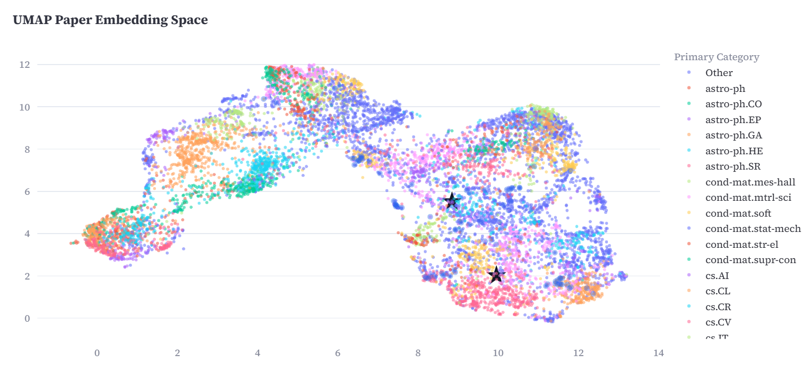
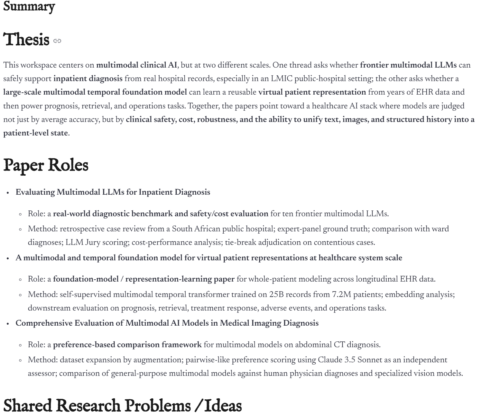
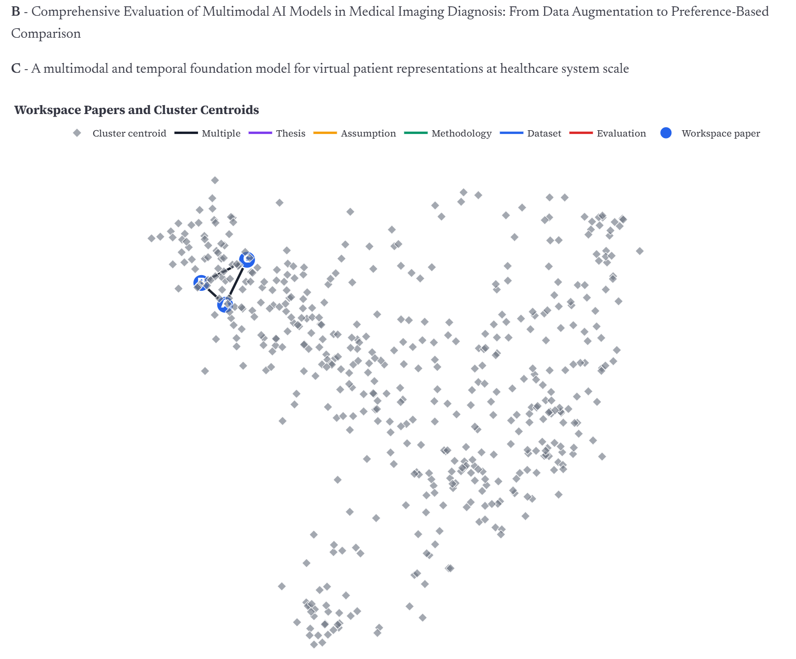

# Folio: arXiv Paper Recommendation

Folio is a local Streamlit app for discovering, saving, searching, and studying arXiv papers. It builds an offline embedding index from arXiv metadata, initializes each user as one or more research-thread vectors, and serves daily recommendations from nearby embedding clusters.

The app is designed to run without a hosted database or vector service. Data artifacts live under `data/`, user state lives in SQLite, and optional Workspace AI summaries use the OpenAI API when an API key is configured.

The full algorithm pipeline is outlined in detail in []

## Application Flow

1. Onboarding
   - Users create an account or continue as a guest.
   - Research interests can come from curated tags, arXiv-backed topic labels, free-text interests, and an optional public Google Scholar profile.
   - Seeds are grouped into 1-3 user research-thread centroids with `user.profile.init_user_profile_v2`.

2. Daily Feed
   - `recommender.engine.recommend` selects nearby clusters, retrieves candidate papers, applies recency scoring, enforces a per-cluster cap, and returns up to 20 papers.
   - Like, Save, and Skip feedback is logged to SQLite and updates the nearest user centroid with an EMA rule.
   - Served papers are marked seen so future feeds avoid repeats.

3. Query Search
   - The search UI embeds a user query with SPECTER2, selects query-near and user-near clusters, and ranks papers with query similarity, user similarity, recency, and lexical evidence.
   - Search feedback follows the same logging and centroid-update path as the Daily Feed.

4. Workspace
   - Saved papers appear in the right-side Folders panel.
   - Papers can be added to the Workspace for synthesis, similar-paper discovery, and concept-map visualization.
   - Workspace summaries and graph connections are cached under `data/workspace_cache/`.

5. Research Lab
   - Opens a saved or selected paper PDF, supports clipping snippets, and stores research notes in SQLite.
   - Notes remain part of Research Lab, not the Folders sidebar.

6. Profile
   - Shows account metadata, feedback counts, preferences, and optional embedding-space visualization when diagnostic artifacts are available.

## Embedding Visualization

Folio can project the paper index into a 2D UMAP view and overlay user centroids, making it easier to inspect where a user's research threads sit inside the broader paper space.



## Optional AI Implementation

Workspace AI is optional. When an OpenAI API key is configured, saved workspace papers can be synthesized into a structured summary and a connection graph. Outputs are cached under `data/workspace_cache/` so repeated views do not regenerate the same analysis.





## Repository Layout

```text
app.py                     Streamlit entry point and page routing
ai/                        OpenAI-backed Workspace summaries, connections, cache
pipeline/                  Offline data pipeline, embeddings, clustering, Scholar parser
recommender/               Daily-feed retrieval, scoring, query search, visualizations
ui/                        Streamlit pages and reusable widgets
user/                      SQLite schema, auth/session helpers, profile updates
scripts/                   Offline pipeline and artifact-generation commands
diagnostics/               Optional analysis and visualization utilities
tests/                     Pytest suite with fake indexes and temp databases
data/                      Runtime artifacts; ignored except data/.gitkeep
docs/                      Project design notes and reference PDFs
```

## Data And Runtime Artifacts

The app expects these generated files in `data/`:

- `embeddings.npy`: paper embedding matrix, memory-mapped at startup
- `cluster_ids.npy`: k-means cluster assignment per paper
- `centroids.npy`: k-means cluster centroids
- `category_centroids.npy`: arXiv category seed vectors
- `paper_meta.jsonl`: metadata aligned row-for-row with `embeddings.npy`
- `concept_embeddings.npy` and `concept_embeddings_meta.json`: optional curated concept-tag embeddings
- `joke_embeddings.npy` and `joke_embeddings_meta.json`: optional loading-message embeddings
- `arxiv_rec.db`: local SQLite users, feedback, seen papers, and Research Lab notes

Generated artifacts are intentionally ignored by git. Keep only `data/.gitkeep` tracked.

## Setup
Running our system requires Python 3.10 or higher

Install dependencies:

```bash
pip install -r requirements.txt
```

Optional Workspace AI features need `.streamlit/secrets.toml`:

```toml
OPENAI_API_KEY = "paste-your-openai-api-key-here"
OPENAI_SUMMARY_MODEL = "gpt-5.4-mini"
OPENAI_CONNECTION_MODEL = "gpt-5.4-mini"
```

The app can still run without an API key, but Workspace summary and connection generation will be unavailable.

## Build The Paper Index


The following command generates Paper Index offline through embedding, which takes a long time. We have a pre-built data file here:https://drive.google.com/file/d/1X33gu6E2TcLCytLG-XsLSivhJge89-y9/view?usp=sharing. Please download and decompress it, then directly overwrite the data directory to avoid running the time-consuming command below.

Run a development-sized offline pipeline:

```bash
python scripts/run_offline_pipeline.py --limit 50000 --seed 42
```

Useful options:

```bash
python scripts/run_offline_pipeline.py --limit 50000 --categories cs.LG,cs.CV --seed 42
python scripts/run_offline_pipeline.py --limit 50000 --run-pca-viz
python scripts/run_offline_pipeline.py --limit 50000 --run-umap-viz
python scripts/build_concept_embeddings.py
python scripts/build_joke_embeddings.py
```

The full arXiv corpus is much larger and can take hours depending on hardware:

```bash
python scripts/run_offline_pipeline.py
```

## Run The App

```bash
streamlit run app.py
```

Open `http://localhost:8501`.

If the app reports missing data, build the offline artifacts first.

## Recommendation Logic

Daily recommendations use a bounded retrieval pipeline:

1. Compute a diversity-controlled cluster budget from the user's exploration setting.
2. Split cluster selection across the user's research-thread centroids.
3. Retrieve top candidates inside selected clusters with dot-product similarity.
4. Score candidates with raw similarity plus a recency bonus from `recommender.scoring`.
5. Enforce no repeats and at most two papers per k-means cluster.
6. If the first pass underfills, expand to a bounded set of nearby clusters rather than scanning the full index.

Feedback updates only the nearest user centroid:

```text
updated = normalize((1 - alpha) * centroid + alpha * feedback_weight * paper_embedding)
```

Default weights are `save=1.5`, `like=1.0`, and `skip=-0.3`.

## Query Search Logic

Query search is separate from the Daily Feed. It expands short queries into paper-like scientific retrieval text, embeds the query, searches query-near and user-near clusters, and ranks a candidate pool with:

- query similarity
- user-profile similarity
- recency
- lightweight lexical evidence from title and abstract

Results include debug fields such as `query_similarity`, `user_similarity`, `recency_score`, `lexical_score`, and `nearest_user_thread`.

## Testing

Run focused cleanup checks:

```bash
pytest tests/test_query_search.py
pytest tests/test_daily_feed_expansion.py
pytest tests/test_db.py
pytest tests/test_engine.py
pytest tests/test_scholar_parser.py
pytest tests/test_onboarding_topics.py
```

Run the normal non-network, non-embedding suite:

```bash
pytest tests -m "not embedding and not slow and not live"
```


Embedding and live Scholar diagnostics are marked separately because they require large local model artifacts or network access:

```bash
pytest -m embedding
pytest -m live
```

## Reset Local User Data

```bash
python scripts/reset_db.py
```

This recreates `data/arxiv_rec.db` and does not rebuild embeddings or metadata.
